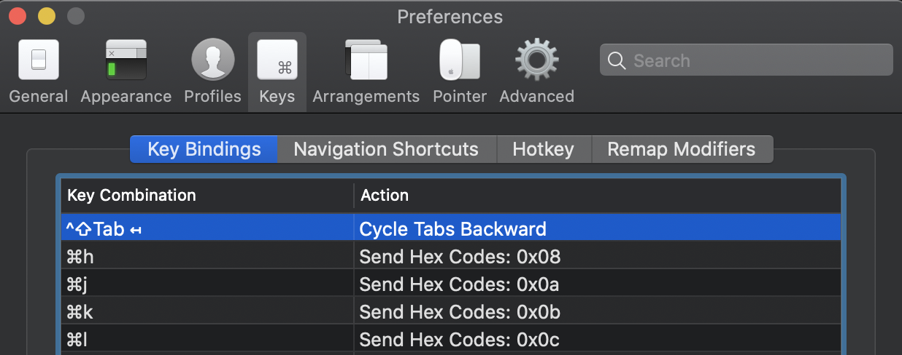

# Config / Dotfiles

## Steps
1. Adjust iTerm preferences: 
    * Import iTerm Profile from /iTerm/Main-Profile.json
    * Add iTerm sortcut keys in to navigate between iTerm windows using Cmd-h/j/k/l | cmd-h = 0x08 | cmd-j = 0x0a | cmd-k = 0x0b | cmd-l = 0x0c 
    * Import iTerm preset "xcodedarkhc"

2. Install [fzf](https://github.com/junegunn/fzf) & [ripgrrep](https://github.com/BurntSushi/ripgrep)
    ```brew install fzf```
    ```brew install ripgrep```

3. Swift support
(make sure [sourcekit-lsp](https://github.com/apple/sourcekit-lsp) it $PATH

